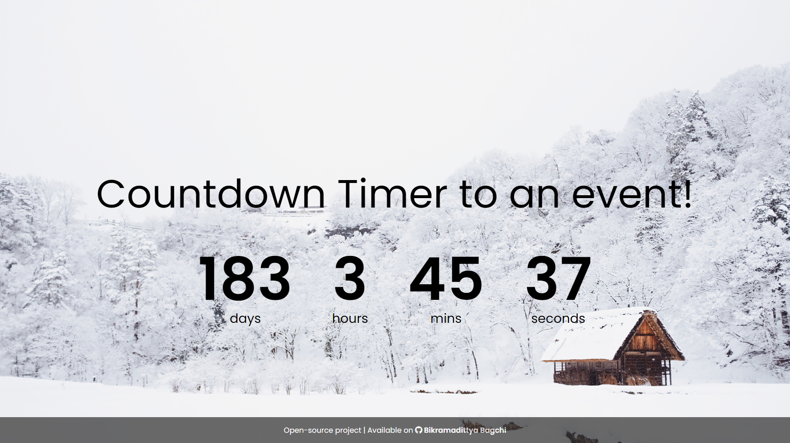

# Countdown timer
##### Date of scripting: 01-07-2021
##### Date of uploading: 01-07-2021
##### Author: Bikramadittya Bagchi
<hr/>
Languages used: HTML5, CSS3, JS

A very basic project of countdown. I have used a date i.e. **01 Jan 2022** as the final date before the event. Please change the date ```dateToEvent``` in ```script.js``` to the date you want. <br/>
Alternatively, you can improve the project to take input and set countdown accordingly. <br/>
Consider giving a :+1: **This is an Open-Source project. You can use it all you want, modify and re-produce with/without permission of the author.**<br/>
**:metal: Happy Coding**<br/>
Attached project preview:


